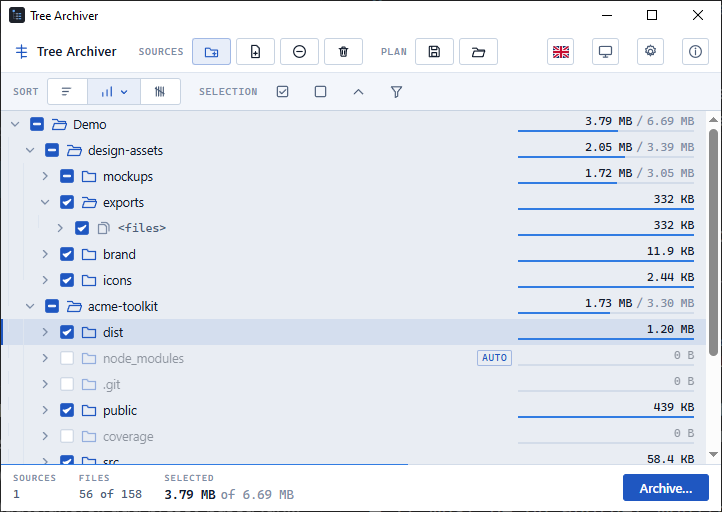
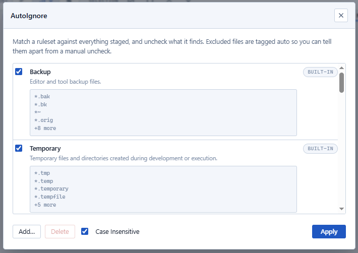
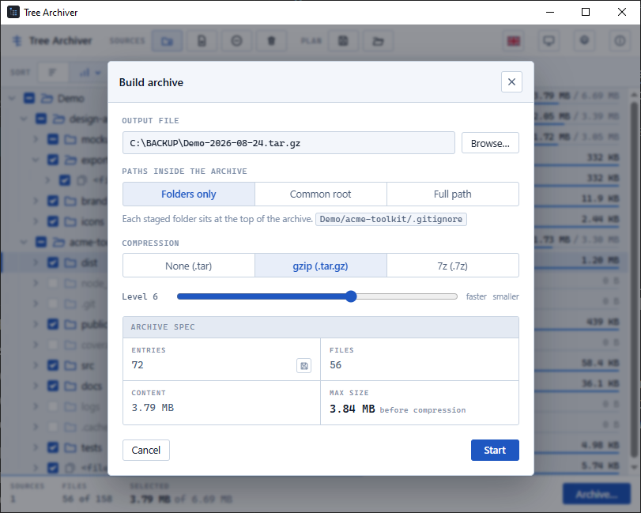
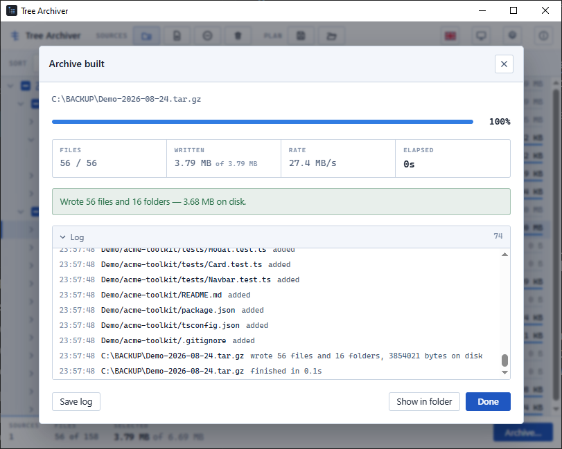
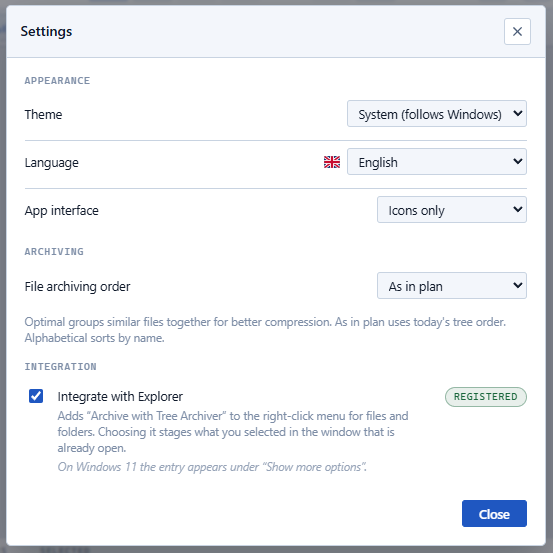

# Tree Archiver

Plan and build TAR / TAR.GZ archives of large directory trees.



Tree Archiver shows the size of every folder before you decide what to include. 

Check or uncheck whole branches at once, and save the selection as a plan you can run again later.

## What it does

- See each folder's size and how much of it is selected before building anything.
- Check or uncheck a whole branch at once. A folder with thousands of loose files still shows as one row.
- AutoIgnore matches a ruleset against everything staged and unchecks what it finds.
- Archive as `.tar`, `.tar.gz`, or `.7z`. Tar size is exact before you build it.
- Progress view with throughput, time remaining, and a saveable log.
- Save a selection as a plan and reopen it later.
- Right-click a folder in Explorer to archive it without opening the app
  first.
- English, Polish, and German. Light, dark, or follows Windows.

## Install

Download the latest release from the
[Releases page](https://github.com/dlvoy/tree-archiver/releases/latest).

| File | Use |
| --- | --- |
| `TreeArchiver-<version>-x64-setup.exe` | Installer. Adds a start menu entry and an uninstaller. |
| `TreeArchiver-<version>-x64-portable.exe` | The application on its own, nothing to install. |
| `TreeArchiver-<version>-x64.msi` | For deployment through Group Policy or Intune. |

Requires 64-bit Windows 10 or 11 and the WebView2 runtime, which ships with
both. Nothing else to install.

These builds are unsigned, so Windows SmartScreen warns on first run.
Choose **More info**, then **Run anyway**. To verify a download against the
release's `checksums.txt`:

```
certutil -hashfile <file> SHA256
```

## Using it

### Adding sources

Drag folders or files onto the window, or use **Add folders** / **Add
files**. Everything arrives fully checked. Uncheck what you want to leave
out. Turn on **Integrate with Explorer** in Settings to add "Archive with
Tree Archiver" to the right-click menu. Picking it stages your selection in
the window that's already open.

### Selection

Each row has a tri-state checkbox: checked, unchecked, or partially
selected. A folder's loose files are grouped under a `<files>` row, so a
folder with 4,000 files stays one row until you open it. Unchecking the
group drops every file in it and leaves subfolders alone. The size column
shows `selected / total` with a hairline meter underneath, so a partly-kept
branch is visible at a glance. Sort by **Name**, **Size**, or **Count**, and
use the keyboard: arrows to move and expand or collapse, <kbd>Space</kbd> to
toggle a row, <kbd>Ctrl</kbd>+<kbd>A</kbd> to check everything,
<kbd>Ctrl</kbd>+<kbd>Shift</kbd>+<kbd>A</kbd> to clear it.

### AutoIgnore



Click **AutoIgnore** to match a catalog of `.gitignore`-style rulesets
against everything staged and uncheck whatever they find. Matched items are
tagged **auto** so you can tell them apart from something you unchecked by
hand. Re-checking one by hand clears the tag for good, even across a later
AutoIgnore run.

Thirteen built-in rulesets cover common cases such as backups, caches,
dependency folders, and OS or editor metadata. Each one lists the exact
patterns it matches, so you can check what it excludes before applying it.
You can also import your own ruleset from any file written in `.gitignore`
syntax. Built-in rulesets can be applied but not deleted. **Case
Insensitive** makes patterns match regardless of letter case.

### Plans

**Save** writes a small file recording what you staged and what you
unchecked. **Open** rescans those sources and reapplies the same decisions.
Unchecking a folder is recorded as a single decision about that whole
branch, not a list of every file inside it, so the plan still makes sense
after the folder's contents change. If something the plan refers to no
longer exists, you're told about it rather than having it silently dropped.

*(Power users: the plan file format is documented in [BUILDING.md](BUILDING.md).)*

### Building the archive



Click **Archive…**, choose where to save, and pick how much of each path to
keep:

| Mode | What ends up in the archive |
| --- | --- |
| **Folders only** | Each staged folder sits at the top |
| **Common root** | The folder the staged paths have in common |
| **Full path** | The whole path, drive letter included |

Then pick a format:

| Format | Writes | Notes |
| --- | --- | --- |
| **None** | `.tar` | The only format whose final size is known exactly in advance |
| **gzip** | `.tar.gz` | Compression level 1–9 |
| **7z** | `.7z` | LZMA2 level 0–9, with an optional **Solid archive** checkbox |

A solid 7z packs every file into one shared stream. It's smaller when there
are many small files, at the cost of coarser progress reporting and slower
extraction of any single file. Before you start, the dialog shows the entry
count, the content size, and the resulting archive size: exact for `.tar`,
an upper bound for gzip and 7z. You can also save just the list of entries
to a text file without building the archive.



While it runs you get a progress bar, throughput, time remaining, and a
collapsible log you can save afterwards. An unchecked folder contributes
nothing to the archive. A file that can't be read is logged and skipped
rather than stopping the run. Cancelling deletes the partial archive.

## Settings



- **Theme**: System, Light, or Dark.
- **Language**: System, English, Polski, or Deutsch.
- **App interface**: icons only, labels only, or both, for the toolbar.
- **File archiving order**: *Optimal* groups similar files together for
  better compression, *As in plan* keeps today's tree order, and
  *Alphabetical* sorts by name.
- **Integrate with Explorer**: adds the right-click entry described above.
  This affects only your own Windows account and needs no administrator
  rights.

## Good to know

- Directory junctions and symlinks are recorded in an archive but never
  followed, so a folder containing a link to its own ancestor can't scan
  forever.
- Paths longer than the legacy 260-character limit work throughout.

## Licence

MIT. See [LICENSE.txt](LICENSE.txt). The full text ships inside the
application and is shown by **About** (the ⓘ button), alongside the version,
build date, and commit the build was cut from.

## Building from source

See [BUILDING.md](BUILDING.md) for the toolchain, local builds, tests, and
the release pipeline.
